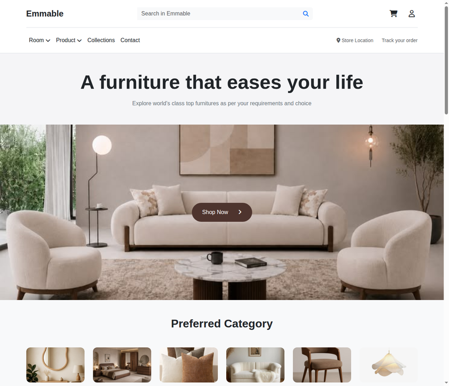
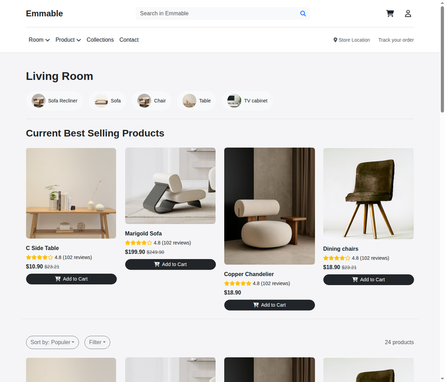
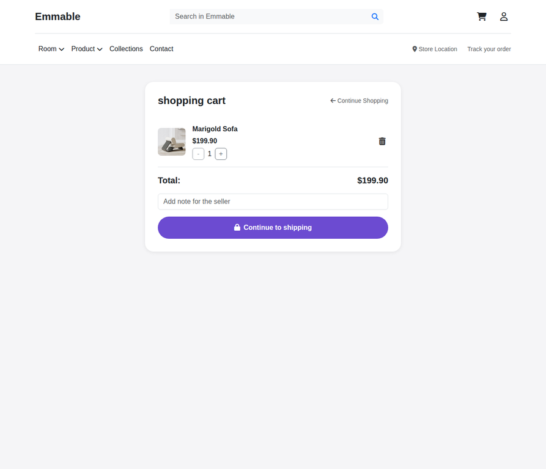

# Emmable — Furniture E-Commerce 🛋️

## Project Overview

**Emmable** is a responsive furniture e-commerce website built with **HTML, CSS, JavaScript, Bootstrap, and Font Awesome**.

The project focuses on creating a realistic frontend shopping experience, from browsing and filtering products to managing a persistent shopping cart and completing a multi-step checkout flow.

## Website Preview

**Live Demo:** https://furniture-e-commerce-sand.vercel.app/

---

## Key Features

- Responsive design for mobile, tablet, and desktop
- Sticky navigation header
- Dynamic product listing and product details
- Product search, category filtering, price filtering, and sorting
- Shopping cart with `localStorage` persistence
- Add, remove, increase, and decrease product quantities
- Dynamic cart counter and order totals
- Multi-step checkout flow with validation
- Empty-cart protection
- Toast notifications for cart actions
- SEO-friendly page metadata

---

## Screenshots

### Home Page

### Products Page

### Product Details

### Shopping Cart

---

## Testing

The project was tested across all 8 pages, covering:

- Navigation and complete shopping flow
- Product search, filtering, and sorting
- Cart functionality and persistence
- Checkout validation and empty-cart protection
- Responsive layouts
- Browser regression testing

Testing covered screen sizes from **360px to 1440px**, with **0 console errors, 0 failed requests, and 0 broken images**.

---

## Run Locally

Clone the repository:

`git clone https://github.com/moustafax7-dotcom/Furniture-E-Commerce.git`

Open the project folder:

`cd Furniture-E-Commerce`

Then open `index.html` in your browser.

---

## About

**Moustafa Mahmoud**

Frontend Developer focused on building responsive and interactive web experiences with **HTML, CSS, JavaScript, Bootstrap, and React**.

### Project Links

- 🌐 [Live Demo](https://furniture-e-commerce-sand.vercel.app/)
-  [Moustafa LinkedIn](https://www.linkedin.com/in/moustafaweb)
